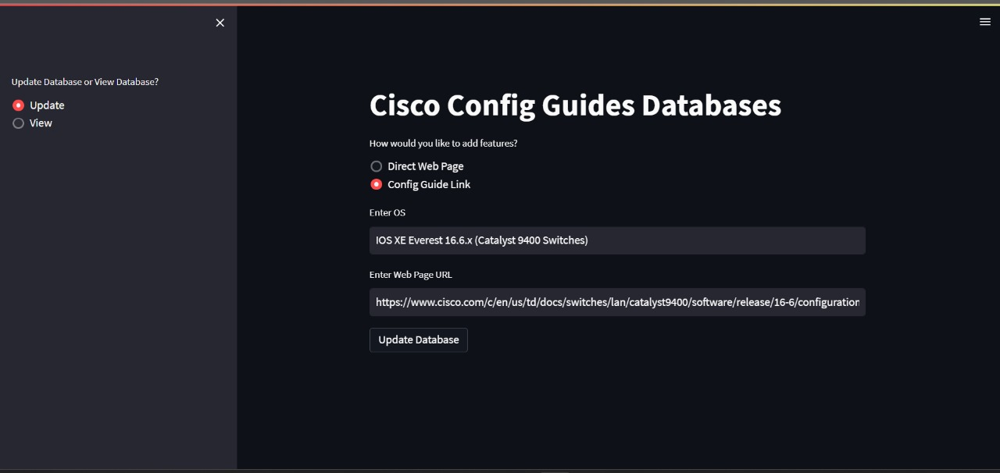
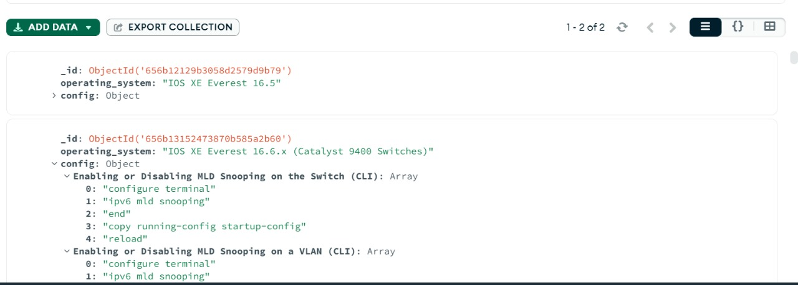
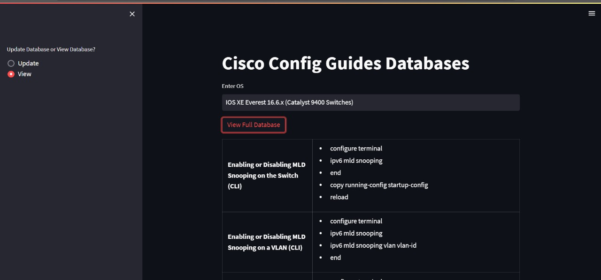

Create a folder named ".streamlit", which will contain a file named "secrets.toml" with the following code:
```bash
  uri = "mongodb://localhost:27017/"
```

Install dependencies

```bash
  pip install -r requirements.txt
```

Start the server

```bash
  streamlit run app.py
```

## Screenshots





